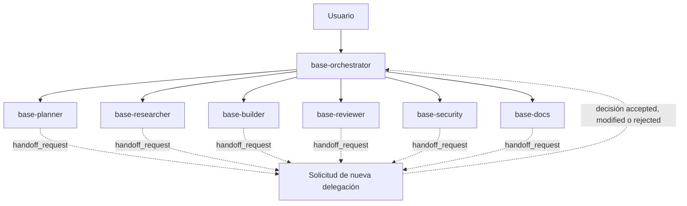

# Jerarquía y capacidades de agentes

Este documento es la fuente canónica de responsabilidades y permisos. Los
controles efectivos residen en `opencode.json` y en el frontmatter de cada
agente.

## Matriz

| Agente | Modo | Edición | Shell | Red/MCP | Delegación |
|---|---|---|---|---|---|
| `base-orchestrator` | `primary`, 24 pasos | Denegada | Denegado | Aprobación | Allowlist exacta |
| `base-planner` | `subagent`, 16 pasos | Denegada | Denegado | MCP personal con aprobación | Denegada |
| `base-researcher` | `subagent`, 14 pasos | Denegada | Denegado | Context7/personal con aprobación | Denegada |
| `base-builder` | `subagent`, 30 pasos | Permitida salvo secretos y ALMA | Aprobación; destructivos denegados | Aprobación | Denegada |
| `base-reviewer` | `subagent`, 18 pasos | Denegada | Aprobación; destructivos denegados | Aprobación | Denegada |
| `base-docs` | `subagent`, 14 pasos | README y perfil con aprobación; `docs/**`, `.opencode/docs/**`, `.opencode/proposals/**` y `.opencode/reports/**` | Denegado | Aprobación | Denegada |
| `base-security` | `subagent`, 18 pasos | Denegada | Scanners con aprobación | Aprobación mínima | Denegada |

## Capacidad y riesgo

- **Coordinación:** Orchestrator decide flujo, riesgo y terminalidad.
- **Construcción:** Builder es el único rol base con edición productiva.
- **Control independiente:** Reviewer y Security no corrigen lo que auditan.
- **Conocimiento:** Planner y Researcher producen contexto, no mutaciones.
- **Memoria:** Docs persiste decisiones sin cambiar políticas centrales.

## Delegación

Los agentes hoja no pueden lanzar tareas. El usuario puede invocar agentes
visibles directamente, pero eso no amplía sus permisos ni completa gates
pendientes. No existe excepción de delegación lateral.

## Selección por riesgo

| Señal | Flujo mínimo |
|---|---|
| Pregunta simple | Orchestrator |
| Diagnóstico o diseño | Planner |
| API o versión externa | Researcher |
| Edición | Orchestrator coordina Builder y después Reviewer |
| Autenticación, secretos, permisos, MCP, red, dependencias, PII | Orchestrator coordina Builder, Reviewer y Security |
| Arquitectura o comandos nuevos | Docs después de aprobación |

## Contratos

El contrato canónico vive en
`.opencode/instructions/agent-contracts.md`. La delegación incluye `task_id`,
owner, remitente, destinatario, objetivo, alcance, dependencias, estado mutable,
aceptación y evidencia esperada.

Cada resultado incluye estado, evidencia, cambios o hallazgos, verificación,
riesgos y acción siguiente. Toda necesidad interrol se expresa como
`handoff_request` y la resuelve Orchestrator.

## Invariantes

- Solo Orchestrator delega.
- ALMA no es editable por agentes.
- Secretos no se leen ni persisten.
- MCP y sharing empiezan deshabilitados.
- Herramientas desconocidas requieren aprobación y los ciclos repetidos activan
  `doom_loop`.
- Todo cambio recibe review.
- Auditoría rechazada no se oculta ni se convierte en éxito.
