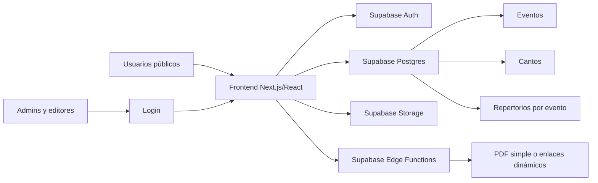
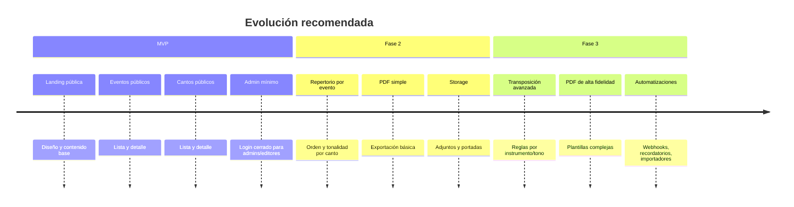

# Viabilidad técnica y práctica del MVP del ministerio musical en plataformas gratuitas

## Resumen ejecutivo

Sí, el MVP que describiste es técnicamente viable hoy con infraestructura gratuita, siempre que separemos bien el alcance inicial de lo que conviene dejar para una fase posterior. La parte pública —**landing pública, lista de eventos, detalle de evento, lista de cantos y detalle de canto**— puede vivir sin problema en hosting estático gratuito. El verdadero punto de inflexión llega cuando agregas **admin básico, autenticación, roles, edición segura, PDFs y repertorios vinculados a eventos**. Ahí ya conviene usar una base de datos y auth gestionados, en lugar de intentar “inventar” un backend propio desde cero. citeturn24search16turn24search0turn4search0turn7search1

La mejor relación entre **simplicidad, seguridad, crecimiento y coste** para tu caso es una ruta “moderna ligera”: **frontend en Vercel o Cloudflare Pages** y **backend en Supabase**. Supabase te resuelve en un solo servicio Postgres, Auth, APIs automáticas, Storage y Edge Functions, además de políticas de seguridad a nivel de fila; eso encaja muy bien con un sitio público donde solo unos pocos administradores crean y editan eventos y cantos. En cambio, Firebase también es viable, pero su modelo de Firestore y sus cuotas diarias gratuitas suelen ser menos cómodos para un proyecto relacional como “evento ↔ repertorio ↔ cantos ↔ roles”. Neon es interesante para Postgres y branching, pero hoy lo veo mejor como alternativa para equipos que ya quieren controlar más su API y despliegue. Koyeb tiene mucho valor cuando necesites un contenedor real para tareas más pesadas —por ejemplo, **HTML→PDF con Chromium/Puppeteer**—, pero su opción gratuita es más limitada para producción sostenida. citeturn4search0turn6search0turn6search8turn28search0turn12search0turn12search3turn16search3turn16search0

Mi recomendación concreta es esta: **empieza con un MVP público + admin mínimo en Next.js/React, desplegado gratis en Vercel, con Supabase para datos/auth**, y deja la generación de PDFs para una Fase 2 con PDF simple en cliente o con una Edge Function ligera. Si más adelante necesitas PDFs complejos, HTML con paginación fina o plantillas tipo “hoja de repertorio imprimible” con fidelidad alta, migras esa parte puntual a Koyeb sin rehacer todo el sistema. Esa secuencia te permite validar utilidad real sin quedar atrapado en una arquitectura sobredimensionada. citeturn21search0turn4search0turn5search2turn16search0turn18search1

## Viabilidad del MVP

Tu MVP tiene dos zonas de complejidad muy distintas. La parte pública es barata y simple: una landing, listados y detalles pueden renderizarse como páginas estáticas o híbridas, con muy poco coste operativo. La parte administrativa ya exige persistencia, permisos y trazabilidad: necesitas al menos **usuarios administradores**, potencialmente **editores**, una estructura de datos relacional para eventos y repertorios, y una forma segura de evitar que cualquiera modifique contenido. Esa separación hace que el proyecto sea mucho más abordable si no intentas resolver todo con un solo bloque desde el día uno. citeturn24search16turn24search1turn4search0turn6search0

A nivel de modelo de datos, este MVP encaja mejor con una base relacional que con una solución puramente documental. La razón no es “porque SQL sea mejor” en abstracto, sino porque aquí hay relaciones evidentes: **eventos**, **cantos**, **tablas puente de repertorio**, **roles**, **metadatos de vestimenta e instrumentos**, y eventualmente **archivos PDF** o adjuntos. Supabase y Neon, al estar sobre Postgres, tienen una ventaja natural en ese diseño. Firebase/Firestore sigue siendo viable, pero su ergonomía es distinta: seguridad fuerte y SDK excelente, sí, pero con un modelo más orientado a documentos y cuotas gratuitas diarias que exigen vigilar lecturas y escrituras desde etapas tempranas. citeturn4search0turn6search0turn12search1turn7search1turn28search1

La funcionalidad futura de **transposición** no es el problema de infraestructura. Cambiar tonalidad o transportar acordes es lógica ligera comparada con el resto del sistema; eso puede correr en cliente o en funciones pequeñas sin exigir un servidor dedicado. Lo que sí condiciona la arquitectura es la **generación de PDFs**. Si el PDF será algo sencillo —texto, acordes, orden de repertorio, portada básica—, puedes resolverlo sin salirte de una arquitectura frontend + BaaS. Si el objetivo evoluciona hacia “imprimir exactamente como se ve la web”, con tipografías, saltos de página complejos y plantillas ricas, ahí ya conviene prever una ruta con contenedor real o servicio especializado. Por eso Koyeb no es mi primera elección para el MVP, pero sí una buena válvula de escape para Fase 2 o 3. citeturn19search0turn5search2turn16search0turn18search9

También hay una diferencia práctica importante entre “gratis para experimentar” y “gratis para operar”. GitHub Pages, Cloudflare Pages y Netlify facilitan alojar lo público casi sin coste. Pero cuando metes datos, auth y administración, el coste real ya no está en el frontend sino en el **backend gestionado, las copias de seguridad y la evolución del contenido**. En otras palabras: el frontend puede seguir gratis bastante tiempo; donde normalmente aparecerá el primer gasto serio será en **Supabase Pro**, **Firebase Blaze** o una **base/servicio siempre activo en Koyeb**. citeturn24search0turn34search11turn4search0turn27search0turn16search3

## Tabla comparativa de plataformas

### Frontend

| Plataforma | Encaje para tu MVP | Gratis relevante | Preview / CI-CD | Dominio y DX | Caveat principal | Fuentes |
|---|---|---|---|---|---|---|
| **Cloudflare Pages** | Muy bueno para sitio público y evolución ligera con Functions/Workers | Git integration con despliegue automático en cada push; soporta React, Next.js, Astro, Vue, SvelteKit y más | Tiene **preview deployments** y flujo Git nativo | Muy buen encaje si luego quieres usar Workers/edge; `create-cloudflare` acelera el arranque | Si creas el proyecto por Git no puedes “cambiar” luego a Direct Upload, y viceversa; logs de Pages Functions no persisten | citeturn2search0turn2search3turn2search5turn23search13 |
| **Vercel Hobby** | Excelente DX para Next.js/React y MVPs híbridos | 1 TB de Fast Data Transfer, hasta 200 horas de build, 50 dominios por proyecto, 100 deployments por día | Buen flujo de despliegue continuo; en esta revisión validé sobre todo límites de Hobby, no una guía puntual de preview URLs | Muy buena experiencia de desarrollo para Next.js; ideal si quieres salir rápido | Si te pasas del Hobby en funciones/uso, la cuenta puede quedar pausada; fuera de Next/SvelteKit, Hobby limita a 12 funciones por deploy | citeturn21search0turn21search2turn21search4 |
| **GitHub Pages** | Muy bueno solo para MVP público sin backend | Hosting estático puro; sitio publicado de hasta 1 GB y ancho de banda “soft” de 100 GB/mes | Publica desde rama o GitHub Actions | Muy barato y simple; custom domain soportado | No está pensado para auth/DB ni lógica dinámica; tampoco encontré en la ruta oficial una experiencia de previews efímeros comparable a Netlify/Firebase/Cloudflare | citeturn24search16turn24search0turn24search1turn24search3turn24search14 |
| **Netlify Free** | Muy bueno para sitios estáticos y revisión colaborativa | 100 GB de bandwidth, 300 build minutes, 125,000 function invocations, 1M edge function invocations, 10 GB storage | **Unlimited deploy previews**; build automático para PRs por defecto | Custom domains con SSL; fuerte en revisión visual y previews | Su modelo comercial reciente gira en torno a créditos/medición; para dominios personalizados de previews/branch deploys conviene Netlify DNS | citeturn19search19turn34search11turn33search1turn33search3turn34search16turn34search4 |

### Datos y autenticación

| Plataforma | Encaje para tu MVP | Gratis relevante | Seguridad / roles | Backups / migración | Caveat principal | Fuentes |
|---|---|---|---|---|---|---|
| **Supabase** | El mejor equilibrio para eventos + cantos + admin | 50,000 MAU, 500 MB DB, APIs ilimitadas, 5 GB egress + 5 GB cached egress, 1 GB file storage | Auth integrado, RLS en Postgres, policies también para Storage | CLI de backup/restore; clonación/migración entre proyectos; backups y restore avanzados mejor en planes pagos | La cuota gratis de DB es pequeña y las funciones edge deben ser cortas; los trabajos pesados no son su mejor fuerte | citeturn4search0turn6search0turn6search8turn31search4turn31search9turn5search2 |
| **Firebase** | Viable si priorizas SDKs cliente y rules | Firestore gratis: 1 GiB, 50k lecturas/día, 20k escrituras/día, 20k deletes/día, 10 GiB salida/mes | Firebase Auth + Security Rules + custom claims | Backups programados y restore existen, pero requieren Blaze; preview channels y Hosting bien integrados | El free tier es diario, no mensual; Firestore es menos natural para relaciones complejas y backups no entran en Spark | citeturn30view0turn8search1turn28search1turn28search9turn27search0turn9search5turn9search7 |
| **Neon** | Buena alternativa Postgres si quieres más control y branching | Free: 100 CU-hours/proyecto, 0.5 GB storage/proyecto, scale-to-zero tras 5 min; Auth hasta 60k MAUs según pricing | Postgres + branching + restauración rápida; Auth aparece ya como componente del producto | Instant restore/time travel: 6 h en Free; soporta estrategias tipo `pg_dump`/`pg_restore` | Para app web real sigues necesitando diseñar tu propia API/lógica; el cold start del compute existe cuando escala a cero | citeturn12search0turn12search1turn14search1turn12search3turn11search10 |
| **Koyeb DB** | Útil solo si ya vas a necesitar contenedor o Postgres muy “manual” | DB free: 0.25 vCPU, 1 GB RAM, 1 GB de datos y solo 5 horas de compute/mes | Es Postgres gestionado, no una solución de app-auth comparable a Supabase/Firebase | No consolidé en esta revisión una oferta de PITR/backup administrado equivalente a Supabase/Neon; la docs sí advierte que eliminar DB es destructivo | El free tier es demasiado corto para una app medianamente viva; además Koyeb pide tarjeta para prevenir abuso | citeturn16search3turn22search5turn22search9 |

### Lógica serverless y edge

| Plataforma | Encaje para tu MVP | Gratis relevante | Latencia / cold starts | Ajuste para PDF y transposición | Caveat principal | Fuentes |
|---|---|---|---|---|---|---|
| **Supabase Edge Functions** | Muy buen complemento si ya usas Supabase | Se integra con tu proyecto Supabase; cobro por invocaciones/uso | Ejecutan cerca del usuario, pero la propia docs dice que hay posibles cold starts y que trabajos pesados deben ir a background workers | Muy bien para lógica ligera, validaciones, webhooks y transposición; razonable para PDF simple | No es el mejor lugar para procesos largos o generación pesada | citeturn3search8turn5search2turn5search5turn4search3 |
| **Cloudflare Workers** | Excelente para lógica muy ligera y edge-first | 100k requests/día, 10 ms CPU por invocación en Free | Muy baja latencia por red global; límite claro de CPU en free | Perfecto para proxys, validaciones y lógica corta; **no** es mi primera opción para HTML→PDF pesado | El límite gratuito de CPU obliga a mantener las funciones realmente pequeñas; custom domains de Workers requieren nameservers en Cloudflare | citeturn19search0turn19search3turn20search1turn20search2 |
| **Koyeb** | La alternativa más parecida a “mini Heroku moderno” | Servicio free: 512 MB RAM, 0.1 vCPU, 2 GB SSD, scale-to-zero tras 1 h | Free instance duerme y puede introducir espera; Koyeb documenta 1–5 s en Deep Sleep y 200 ms con Light Sleep | La mejor opción de esta lista si luego necesitas Chromium/Puppeteer o jobs más pesados dentro de un contenedor | El free instance no está recomendado para producción y se limita a una sola región gratis | citeturn16search2turn16search0turn18search1turn25search0 |

## Recomendaciones de ruta

La decisión correcta no es “qué stack suena más moderno”, sino **qué combinación te permite salir rápido sin hipotecar el crecimiento**. Para este MVP te propongo tres rutas claras.

**Ruta mínima sin backend.** Usa **GitHub Pages** o **Cloudflare Pages** para un sitio público estático, con los eventos y cantos como archivos Markdown/JSON versionados en Git. Es la ruta más barata y más fácil de lanzar, y te da una web funcional desde ya. La desventaja es que el “admin” no será realmente admin: editar contenido implicará tocar el repo o depender de un flujo manual. Esta ruta solo la recomiendo si quieres validar diseño, estructura y utilidad pública antes de meter autenticación. citeturn24search16turn24search1turn2search0turn2search3

**Ruta moderna con Supabase.** Usa **Vercel + Supabase** como vía principal. En frontend, Vercel te da una experiencia muy limpia con React/Next.js y un Hobby generoso. En backend, Supabase te evita montar auth, API, base de datos y storage por separado. Esta ruta es la que mejor encaja con tu caso porque el panel admin puede ser pequeño pero seguro: admins y editores entran con login, el resto solo consume contenido público, y las políticas RLS controlan exactamente quién crea, edita o publica un evento/canto. Además, te deja el camino abierto para repertorios vinculados a eventos y PDFs en Fase 2 sin romper la base. citeturn21search0turn4search0turn6search0turn6search8turn31search18

**Ruta alternativa tipo Heroku/Koyeb.** Usa **Koyeb + Postgres** si ya sabes que pronto necesitarás un servicio de Node real, posiblemente con SSR más controlado o generación pesada de PDFs. Es la ruta menos conveniente para el primer MVP gratis, porque el free tier de su base de datos dura muy poco en compute y el free web service no está pensado para producción sostenida. Pero si tu visión ya incluye exportación compleja, colas, tareas largas o Puppeteer, Koyeb empieza a tener mucho sentido como evolución táctica. citeturn16search3turn16search2turn16search0turn18search9

Mi recomendación final es: **Ruta moderna con Supabase, poniendo el frontend en Vercel**. Si por preferencia personal quieres un enfoque más “edge” o más cercano al ecosistema Cloudflare, la misma ruta sigue siendo válida cambiando Vercel por Cloudflare Pages. Lo importante no es tanto el host del frontend, sino que el sistema de datos/roles quede bien resuelto desde el inicio. citeturn21search0turn4search0turn2search5turn2search0



La arquitectura anterior mantiene el frontend casi estático para lo público, y solo activa backend real donde aporta valor: login, permisos, escritura y automatización. Esa es la razón por la que esta ruta suele ser la más sostenible para un proyecto de hobby serio que puede crecer a herramienta interna real. citeturn4search0turn5search2turn6search0turn6search8

## Despliegue paso a paso de la ruta recomendada

La ruta recomendada es **Next.js en Vercel + Supabase**. No porque sea la única, sino porque reduce fricción de desarrollo y deja la puerta abierta para crecer sin rehacer el proyecto. Vercel Hobby cubre bien el frontend y Supabase cubre datos, auth, storage y funciones edge. citeturn21search0turn4search0turn31search18

### Secuencia propuesta

**Paso 1.** Crea el frontend con Next.js o React. Si quieres el camino más estándar y mantenible para listados, detalles y panel admin pequeño, usa Next.js. La elección práctica aquí no es “por moda”, sino porque te deja renderizar páginas públicas y privadas sin pelear con la estructura del proyecto. Vercel tiene soporte muy pulido para ese flujo y un plan Hobby suficientemente amplio para un MVP. citeturn21search0turn21search4

```bash
npx create-next-app@latest ministerio-mvp
cd ministerio-mvp
npm install @supabase/supabase-js
```

**Paso 2.** Crea un proyecto en Supabase y define la región primaria más cercana posible a tus usuarios. Para una audiencia centrada en Centroamérica, la decisión práctica suele ser escoger una región de EE. UU. Este o similar cuando esté disponible, porque Supabase recomienda elegir la región más cercana a tus usuarios y sus Edge Functions pueden ejecutarse cerca del usuario, aunque para operaciones intensivas de DB conviene alinearlas con la región primaria de la base. citeturn3search3turn3search8

**Paso 3.** Crea las variables de entorno del frontend. El cliente web debe usar solo la URL pública del proyecto y la `anon key`; las credenciales privilegiadas nunca deben vivir en el navegador. Esa separación no es un detalle menor: es la base de que el frontend pueda hacer consultas seguras apoyándose en RLS en vez de confiar en que “nadie verá las llaves”. citeturn6search0turn6search8

```env
NEXT_PUBLIC_SUPABASE_URL=tu_url_de_supabase
NEXT_PUBLIC_SUPABASE_ANON_KEY=tu_anon_key
```

**Paso 4.** Modela la base con poco pero bien. Para el MVP basta con seis tablas conceptuales: `profiles`, `events`, `songs`, `event_songs`, `song_versions` y, si quieres PDFs o archivos, `assets`. En `profiles` guarda el rol (`admin`, `editor`). En `event_songs` guarda el orden del repertorio y la tonalidad elegida para ese evento, para no tocar la “versión base” del canto cada vez. Esta decisión te ahorra mucho dolor más adelante. La seguridad debe aplicarse con RLS para que solo admins/editores modifiquen registros, mientras la lectura pública quede abierta solo para contenido publicado. Supabase documenta precisamente esa combinación entre Auth y RLS como su modelo de autorización recomendado. citeturn6search0turn6search4turn31search18

```sql
create table profiles (
  id uuid primary key,
  role text not null check (role in ('admin','editor'))
);

create table events (
  id bigserial primary key,
  slug text unique not null,
  title text not null,
  event_type text,
  starts_at timestamptz not null,
  meet_at timestamptz,
  location text,
  clothing_men text,
  clothing_women text,
  setup_type text,
  description text,
  is_published boolean default false,
  created_by uuid
);

create table songs (
  id bigserial primary key,
  slug text unique not null,
  title text not null,
  lyrics text not null,
  base_key text,
  tags text[] default '{}',
  is_published boolean default false,
  created_by uuid
);

create table event_songs (
  event_id bigint references events(id) on delete cascade,
  song_id bigint references songs(id) on delete cascade,
  sort_order int not null,
  target_key text,
  notes text,
  primary key (event_id, song_id)
);
```

**Paso 5.** Implementa el frontend público primero. Tus rutas mínimas pueden ser estas: `/`, `/eventos`, `/eventos/[slug]`, `/cantos`, `/cantos/[slug]`. Si quieres que los administradores no entren por un “portal raro”, agrega simplemente `/admin` con layout separado y protección por sesión. Esa separación ayuda a que lo público siga siendo simple y optimizable, y lo privado quede encapsulado. citeturn21search0turn24search16

**Paso 6.** Agrega autenticación solo para admins y editores. En esta fase no hace falta registro público. Crea los usuarios manualmente desde Supabase Auth y así mantienes el panel totalmente cerrado. La ventaja de Supabase aquí es que no tienes que levantar un sistema externo para email/password u OAuth; ya lo trae integrado. citeturn31search18turn4search6

**Paso 7.** Despliega en Vercel conectando el repositorio Git. Sube el código a GitHub, importa el repo en Vercel, configura las variables de entorno y despliega. Vercel Hobby ya incluye suficiente transferencia y tiempo de build para una app de este tamaño. Si prefieres Cloudflare, el flujo equivalente existe con `create-cloudflare` y Git integration en Pages. citeturn21search0turn2search0turn2search5

```bash
git init
git add .
git commit -m "MVP inicial"
git branch -M main
git remote add origin <tu_repo>
git push -u origin main
```

**Paso 8.** Añade funciones solo donde realmente aporten. En el MVP, lo normal es que ni siquiera necesites una función serverless para listar eventos o cantos: Supabase ya expone APIs. Reserva Edge Functions para casos como “generar enlace de repertorio”, “crear PDF simple”, “normalizar tonos”, “webhook de publicación” o “importar datos”. La propia documentación de Supabase recomienda diseñarlas para operaciones cortas e idempotentes y mover trabajos pesados a procesos de background. citeturn5search2turn5search5

**Paso 9.** Define una política de respaldo desde el inicio. Si te quedas en free, usa al menos exportaciones/backup por CLI en hitos importantes. Si el proyecto empieza a usarse de verdad, el primer upgrade sensato es Supabase Pro por las copias y más holgura de proyecto. Ese salto vale mucho más que pagar antes por el frontend. citeturn31search4turn31search2turn5search10

## Riesgos, costes y hoja de ruta

El principal riesgo técnico no es el stack, sino **meter demasiadas funciones en la primera versión**. Si intentas lanzar a la vez landing, calendario, detalle enriquecido, gestión de repertorios, transposición avanzada, exportación PDF perfecta, roles, adjuntos y edición colaborativa, la complejidad sube más por producto que por infraestructura. La mitigación correcta es congelar un MVP con tres certezas: contenido público legible, eventos administrables por pocas personas y repertorio por evento. Todo lo demás puede entrar después. citeturn4search0turn6search0turn5search2

El segundo riesgo es de seguridad. En un sistema como el tuyo es tentador “dejar abierto para solo editar desde la UI”, pero eso no basta. Debes diseñar los permisos en la base, no solo en la interfaz. Supabase lo resuelve con RLS y Firebase con Security Rules; ambos permiten autorización granular, pero Supabase encaja mejor con roles tipo admin/editor sobre modelos relacionales. Si optaras por Koyeb/Neon y API propia, tendrías que construir tú mismo una parte mayor de esa capa de autorización. citeturn6search0turn28search1turn28search9turn12search1

El tercer riesgo es de experiencia de uso cuando el servicio “duerme”. Eso afecta sobre todo a Koyeb y Neon si dependen de scale-to-zero. Neon documenta activaciones desde idle de unos pocos cientos de milisegundos. Koyeb documenta 1–5 segundos en Deep Sleep y 200 ms con Light Sleep, además de que el free instance baja a cero sin tráfico y no lo recomiendan para producción. Para un calendario y un cancionero consultados antes de misa o ensayo, ese tipo de espera sí se nota. Por eso no pondría la experiencia principal del MVP sobre un contenedor gratuito dormido, salvo que no tengas otra opción. citeturn14search1turn16search0turn16search2

En costes, la buena noticia es que un tráfico moderado suele caber bastante tiempo en frontend gratuito. Si defines “moderado” como unos cientos de usuarios al mes, unas pocas decenas de administraciones/ediciones, y contenido principalmente textual, **Vercel Hobby**, **Cloudflare Pages**, **GitHub Pages** o **Netlify Free** probablemente seguirán siendo suficientes en el frontal. Donde antes verás coste es en el backend y la persistencia. En una ruta con Supabase, lo razonable es pensar en **$0 al inicio** y luego **un primer gasto cercano a Supabase Pro** cuando ya necesites backups robustos, más almacenamiento o más egress. En la documentación analizada, los ejemplos de facturación de Supabase muestran el plan Pro en torno a **$25/mes**, y el plan incluye 100k MAU, 250 GB de bandwidth y backups diarios con retención de 7 días. Vercel Pro, si alguna vez lo necesitas por colaboración o límites, parte de **$20 por usuario/mes**. citeturn5search10turn4search1turn21search0

Si eliges la alternativa Koyeb para operación “más servidor”, el coste sube antes. Solo la **base pequeña de Koyeb** figura en **$29.76/mes**, y un **servicio eco-small** para app ronda **$5.36/mes**, antes de pensar en más almacenamiento o tráfico; eso deja un escenario muy simple cerca de **$35/mes**. Por eso Koyeb me parece mejor como “salida para una necesidad concreta” que como base del MVP gratis. En Neon, el buen news es que no hay mínimo mensual en planes pagos y el coste depende de uso; pero una base pequeña “always-on” con el orden de magnitud que Neon pone como “low load” deja de ser realmente gratuita con bastante rapidez. citeturn16search3turn16search2turn12search0turn12search1



Como hoja de ruta final, yo haría esto: **MVP en Vercel + Supabase**, luego **PDF simple** dentro de la misma ruta, y solo si la necesidad lo exige movería la parte de PDF complejo a **Koyeb**. Si quisieras un MVP todavía más austero para validar valor antes de tocar auth, entonces sí arrancaría con **GitHub Pages** o **Cloudflare Pages** y contenido versionado en Git, sabiendo que eso es una prueba de producto, no todavía el sistema definitivo. citeturn21search0turn4search0turn24search16turn2search0

Quedan dos limitaciones abiertas de esta investigación. La primera: en esta pasada validé con más detalle los límites y precios de **Vercel Hobby, Netlify Free, Supabase, Firebase, Neon y Koyeb** que algunos detalles finos de **custom domains y previews en Cloudflare Pages** y el flujo específico de **preview URLs de Vercel**. La segunda: **Koyeb** hoy ofrece una base de datos gratuita muy corta y no consolidé una documentación oficial equivalente a Supabase/Neon para backups administrados de base de datos; por prudencia, lo trato como una zona menos madura para resguardo de datos. citeturn2search3turn21search0turn16search3turn12search3