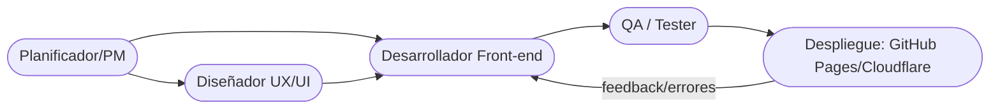
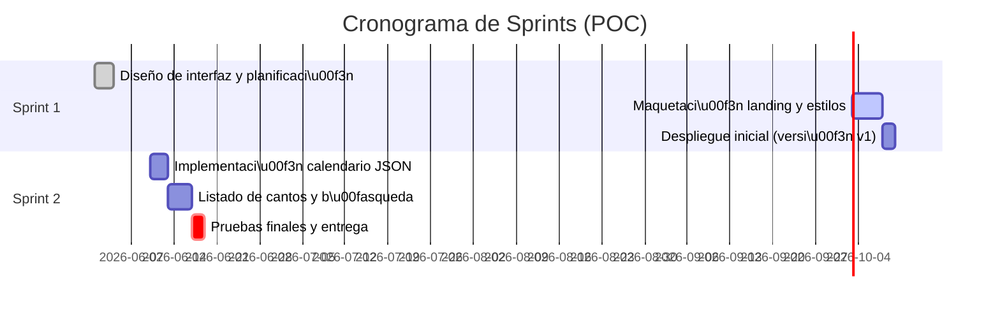

# Resumen Ejecutivo  
El objetivo de la POC es construir una web estática sencilla que centralice la información del ministerio de música: página principal con descripción del grupo, calendario de ensayos/eventos y repertorio de cantos con letras y acordes. El alcance mínimo incluye al menos una landing page, listado de fechas-eventos (editable vía JSON) y una sección para buscar cantos. El éxito se mide en que los miembros puedan ver fácilmente los eventos programados (y agregarlos a su calendario Google) y acceder a las letras de los cantos en línea. La solución debe ser práctica y usable por adultos no técnicos. 

## 1. Roles y Habilidades Clave  
- **Project Manager (PM)** – Prioridad alta, nivel intermedio/avanzado. Define el backlog, planifica los sprints y comunica al equipo. Habilidades: gestión de proyectos Ágil, comunicación, división de tareas.  
- **Desarrollador Front-end** – Prioridad alta, nivel intermedio/avanzado. Responsable de HTML/CSS/JS, maquetación responsive y accesible. Habilidades: semántica HTML, CSS moderno (Flexbox/Grid), JavaScript (fetch/DOM), control de versiones Git.  
- **Diseñador UX/UI** – Prioridad media, nivel intermedio. Diseña interfaz y experiencia de usuario. Habilidades: herramientas de diseño (Figma/Sketch), prototipado, guías de estilo, análisis de usuarios.  
- **QA / Tester** – Prioridad media, nivel básico/intermedio. Verifica que la web funcione en distintos navegadores y dispositivos, que los contenidos carguen correctamente y que no haya errores (links rotos, datos faltantes). Habilidades: pruebas manuales, uso de herramientas de testing (validator HTML, audit accesibilidad), atención al detalle.  
- **Administrador de Despliegue (DevOps)** – Prioridad media, nivel intermedio. Configura el repositorio Git, automatiza despliegues en la plataforma free elegida (GitHub Pages, Cloudflare Pages, Vercel). Habilidades: Git/GitHub, conocimiento de CI/CD simples, configuración DNS/subdominios.  

## 2. Perfiles de Competencia (MCP)  
Cada rol tiene las siguientes responsabilidades, entregables y criterios:

- **Desarrollador Front-end**  
  - *Responsabilidades*: Crear la estructura HTML, estilos CSS y scripts JS que consuman datos (JSON). Maquetar la landing y secciones (calendario, repertorio).  
  - *Entregables*: Archivos `index.html`, CSS (e.g. `styles.css`), scripts (`app.js`), JSON de datos (`events.json`, `songs.json`), README de instalación.  
  - *Tiempo estimado*: ~4–6 días.  
  - *Criterios de aceptación*: El sitio carga correctamente en navegadores modernos; el calendario muestra las fechas cargadas desde JSON; la lista de cantos muestra letras buscables; se valida HTML/CSS sin errores críticos.  

- **Diseñador UX/UI**  
  - *Responsabilidades*: Definir wireframes o prototipos del sitio; seleccionar tipografía y esquema de colores coherentes con la iglesia; optimizar la experiencia de usuario.  
  - *Entregables*: Mockups (JPEG/PNG o prototipo web), guía de estilos (colores, fuentes), flujos de navegación.  
  - *Tiempo estimado*: ~2–3 días.  
  - *Criterios de aceptación*: Diseño claro y armonioso; interfaz intuitiva (botones/página legible); consideraciones de accesibilidad básicas (contraste, navegación tabulable).  

- **QA / Tester**  
  - *Responsabilidades*: Probar la web completa. Verificar funcionamiento en desktop y móvil, probar enlaces, validación de datos (fechas, letras), revisar accesibilidad mínima.  
  - *Entregables*: Listado de errores/encontrados (documento o tickets), evidencia de pruebas (capturas o logs).  
  - *Tiempo estimado*: ~1–2 días.  
  - *Criterios de aceptación*: Todos los bugs críticos corregidos; contenido coincidente con requisitos (fechas correctas, letras bien cargadas); compatibilidad básica (Chrome/Edge/Firefox móvil).  

- **Administrador de Despliegue**  
  - *Responsabilidades*: Crear el repositorio Git, configurar CI/CD con la plataforma elegida. Garantizar despliegues automáticos en cada push.  
  - *Entregables*: Cuenta GitHub con repo público; pipeline de despliegue (GitHub Actions o conectada a Cloudflare/Vercel). Documentación de deploy.  
  - *Tiempo estimado*: ~1 día.  
  - *Criterios de aceptación*: Cada commit/pull request genera preview y despliega la web en el dominio gratuito (*.github.io, *.pages.dev o *.vercel.app); SSL habilitado.  

- **Project Manager (PM)**  
  - *Responsabilidades*: Recopilar requerimientos (ubicaciones de eventos, colores litúrgicos, etc.), priorizar features (p. ej. primero calendario, luego letras), gestionar tareas en sprints.  
  - *Entregables*: Documento de visión del proyecto, lista de tareas (issues) y cronograma de sprints (p. ej. 1 semana por sprint).  
  - *Tiempo estimado*: continuo (planificación inicial ~1 día, luego revisión al final de cada sprint).  
  - *Criterios de aceptación*: Roadmap claro; tareas definidas con criterios claros; equipo alineado con objetivos del sprint.  

## 3. Arquitectura y Stack para la POC  
La POC será **100% estática**: HTML + CSS + JavaScript puro. No hay backend complejo. Los datos (fechas de eventos y repertorio) se guardarán en archivos JSON simples dentro del repo (e.g. `events.json`, `songs.json`). El JS del front-end los consume mediante `fetch`.  

Para hosting *gratuito* las opciones recomendadas son: **GitHub Pages**, **Cloudflare Pages** y **Vercel Hobby**. Por ejemplo, Vercel ofrece 100 GB/mes gratis en su plan hobby con subdominio `*.vercel.app`; Cloudflare Pages permite hosting ilimitado con subdominio `*.pages.dev`. En la práctica, Cloudflare Pages es ideal pues no limita el uso comercial y no impone tope de tráfico. GitHub Pages (subdominio `usuario.github.io`) también permite unos ~100 GB/mes (soft cap) y es muy sencillo para sitios estáticos.  

Como base de datos simple sin servidor, arrancamos con **JSON estáticos**. Si más adelante se requiere datos dinámicos (o multiusuario), podríamos migrar a **Supabase** (base Postgres + auth); Supabase incluso ofrece un MCP oficial que permite a agentes IA leer/escribir datos SQL. En la versión inicial, bastan los JSON y formularios estáticos.  

## 4. Ejemplos de Skills/Agentes (skills.sh, UI-Skills, MCPServers)  
Podemos aprovechar habilidades (skills) preexistentes para agilizar tareas:  
- **UI/UX y Maquetación:** Del repositorio UI Skills destacamos **`baseline-ui`** (para pulir márgenes, tipografía y jerarquía visual), **`fixing-accessibility`** (audit y corrección de accesibilidad HTML/ARIA), **`frontend-design`** (genera código UI creativo de calidad) e **`interface-design`** (para diseños de páginas administrativas o dash). Por ejemplo, un agente Build podría invocar `baseline-ui` para corregir CSS básicos, o `fixing-accessibility` para añadir etiquetas ARIA.  
- **Control de versiones:** Un skill como **`git-release`** (ejemplo en skills.sh) crea notas de lanzamiento automáticamente. Esto agiliza la creación de versiones consistentes. También hay skills para gestionar Issues o tareas via GitHub.  
- **Integración de datos:** Para la futura base de datos, existe el **Supabase MCP**, que permite a agentes IA ejecutar queries SQL y manejar la base. Por ahora no se usa, pero demuestra cómo un agente podría interactuar con la base de datos en una versión avanzada.  
- **Despliegue/CI:** Hay herramientas MCP oficiales (e.g. *Vercel MCP*, *Cloudflare Workers MCP*) que un agente Build podría usar para consultar el estado de despliegues o configuraciones de DNS. Incluso hay *Chrome DevTools MCP* para debugging en navegadores.  
- **Combinar Agentes:** En OpenCode, podemos usar el agente **Plan** para investigar y listar requerimientos (usando habilidades de investigación), y el agente **Build** con los skills UI mencionados para codificar. El agente **General** puede ayudar a tareas múltiples (por ej. crear los JSON usando un skill de generación de datos estructurados).  

## 5. Flujo de Trabajo (OpenCode + Agile)  
- **Planificación en sprints:** Siguiendo Scrum ligero, definimos sprints breves (1–2 semanas). El PM crea un backlog (issues de GitHub) con tareas: página landing, calendario, gestión de eventos, sección de cantos, etc. En cada sprint se asignan issues a agentes (usuarios/roles). Por ejemplo, Sprint 1: maquetar landing y desplegar sitio base; Sprint 2: agregar calendario y lista de cantos. Cada final de sprint se revisa el avance. La idea es “iterar y desplegar rápido”.  
- **OpenCode Agents:** Usamos los agentes integrados de OpenCode. El agente *Plan* (modo solo-análisis) puede revisar los archivos y sugerir la estructura sin escribir código. El agente *Build* (modo con herramientas habilitadas) crea/edita archivos HTML/CSS/JS. Podemos invocar subagentes con skills específicas cuando sea útil. Por ejemplo, invocar *General* con el skill `baseline-ui` para ajustar el CSS, o *Plan* con `interface-design` para diseñar un mockup de la landing.  
- **Control de versiones:** Todo el código y datos vive en un repo GitHub. Cada tarea/cambio se hace en una rama o pull request. Se fomentan commits atómicos y descripciones claras. Se puede usar GitHub Projects para gestionar el flujo.  
- **Integración continua:** Configuramos GitHub Actions o la integración nativa de la plataforma elegida: al hacer push a `main`, el sitio se vuelve a desplegar automáticamente. Por ejemplo, Cloudflare Pages se integra directo con GitHub.  
- **Pruebas y QA:** Después de cada entrega, un tester (o agente QA) verifica manualmente el sitio. Se puede añadir CI ligero: tests automáticos de HTML/CSS (linters) o scripts que validan que los JSON tengan formato correcto. Los resultados deben registrarse en el repo.  
- **Deploy continuo:** Aseguramos un flujo donde “push → build → deploy” sin intervención. Así el equipo puede probar al instante. Se usan entornos temporales (previews) antes de mezclar con `main`.  



## 6. Checklist de Entregables (POC)  
- **Páginas HTML:** `index.html` (landing con intro del ministerio), secciones internas (por ejemplo, `eventos.html`, `cantos.html`) o todo en una sola página con anclas. Debe incluir una sección de calendario (embebido o listado).  
- **Componentes Front-end:** HTML semántico (header, nav, main, footer), CSS responsivo (ej. menú hamburguesa móvil), JavaScript para cargar y filtrar datos JSON.  
- **Archivos JSON:**  
  - `events.json`: lista de eventos (fecha, hora, descripción, ubicación, colores litúrgicos, repertorio asociado).  
  - `songs.json`: listado de canciones (título, letra, acordes).  
  - (Opcional) `repertoire.json`: array ordenado para cada evento.  
  Ejemplo (flujos de evento y canciones, ver más abajo).  
- **Scripts JS:** Al menos un script (`app.js`) que use `fetch` para leer `events.json` y `songs.json`, renderice el calendario y la lista de cantos, y permita búsqueda simple (por título o fecha).  
- **Estilos CSS:** Archivo de estilos (`styles.css`) aplicando layout limpio. Testear en varios tamaños.  
- **README / Documentación:** Instrucciones para clonar el repo, cómo editar el JSON, cómo desplegar (por ejemplo: “push a main → deploy automático”).  
- **Dominio Temporal:** El sitio en vivo en un subdominio gratuito (ej. `https://miembros-musica.pages.dev/`).  
- **Criterios de aceptación:** El sitio carga sin errores en Chrome/Firefox; el calendario muestra las fechas de `events.json`; los cantos de `songs.json` se despliegan con todas sus líneas; es posible agregar el evento al calendario personal. Todos los links funcionan y la UI es usable en móvil.  

```json
// Ejemplo: events.json
[
  {"fecha":"2026-07-05","titulo":"Ensayo semanal","hora":"19:00","lugar":"Iglesia Central","tipo":"Ensayo"},
  {"fecha":"2026-07-10","titulo":"Misa dominical","hora":"10:00","lugar":"Parroquia San José","tipo":"Misa"}
]
```

```json
// Ejemplo: songs.json
[
  {"titulo":"Ven, Espíritu de Dios","tonalidad":"Do","letra":"Ven, Espíritu de Dios,\nmanda tu luz desde el cielo...","acordes":"[C] [G] [Am] [F] ..."},
  {"titulo":"Oh Solemne Fiesta","tonalidad":"Sol","letra":"Oh solemne fiesta\nque llena de gozo y amor...","acordes":"[G] [D] [Em] [C] ..."}
]
```

## 7. Riesgos y Mitigaciones  
- **Aceptación de usuarios mayores:** Los miembros del ministerio pueden ser personas adultas sin experiencia técnica. Riesgo: se resistan a usar la web. Mitigación: mantener interfaz extremadamente simple, instrucciones claras. Por ejemplo, enviar un PDF del sitio o incluir tutorial en la landing.  
- **Formato de acordes y letras:** Los acordes suelen tener formatos diversos (Midomi, Pro, imágenes). Riesgo: incompatibilidad de formatos o derechos de autor. Mitigación: usar texto plano con convenciones simples (ej. separar acordes entre corchetes) y señalar la fuente. Incluir sólo letras con permiso (música litúrgica suele permitirse bajo CC o dominio público).  
- **Transposición futura:** Cambiar la tonalidad de un canto es complejo (restringido en la POC). Mitigación: documentar bien el estándar de acordes; planear módulo de transposición en versión avanzada, usando librerías JS especializadas o generando PDFs dinámicos.  
- **Derechos de autor:** Las letras pueden estar protegidas. Riesgo legal. Mitigación: usar fuentes religiosas autorizadas (p. ej. himnario litúrgico) o pedir permiso a la diócesis. Añadir nota de contenido “uso interno del ministerio”.  
- **Actualización de datos:** Un único administrador actualiza manualmente los JSON. Riesgo: datos desactualizados. Mitigación: promover buena práctica (revisiones mensuales) o migrar a formulario web en versión futura.  

## 8. Plan de Transición a Versión “Moderna”  
En la versión avanzada se agregarían: autenticación de usuarios, base de datos, y funciones extra. Por ejemplo:  
- **Autenticación y Roles:** Integrar Supabase Auth (o Firebase Auth) para que solo administradores autorizados editen eventos/cantos. Así cada quién inicie sesión con email/parola.  
- **Base de Datos Supabase:** Migrar los JSON a tablas en Supabase. Esto facilita consultas complejas y escalabilidad. Se usaría el **Supabase MCP** para que el agente IA (o backend) actualice eventos sin exponer claves.  
- **Editor de contenidos:** Un panel sencillo para agregar/editar eventos y canciones vía web, conectado a la base.  
- **Generación de PDF:** Usar un MCP como *GuruPDF* (que convierte HTML/MD a PDF) para descargar el listado de cantos en PDF formateado.  
- **Transposición dinámica:** Incluir librerías JS (p.ej. ChordTransposer) para cambiar tonalidad al vuelo. Podría implementarse también como skill personalizado.  
- **Otras mejoras:** Mejorar SEO (etiquetas meta), añadir sistema de notificaciones (email o WhatsApp), integrar enlaces de streaming de cánticos, etc.  

La migración se haría iterativamente: una vez validada la POC HTML/CSS/JS básica, se planifican las fases de la versión moderna. Por ejemplo, en Sprint 3 migrar `events.json` a Supabase, Sprint 4 añadir login, Sprint 5 implementar transposición.  



## 9. Recursos Prioritarios (enlaces útiles)  
- **GitHub Pages:** Documentación oficial (página estática desde un repo GitHub).  
- **Cloudflare Pages:** Sitio en español con info general y docs en Cloudflare Developers.  
- **Vercel (Hobby):** Blog de NMTech (may 2026) sobre hosting gratis.  
- **Supabase:** Documentación oficial de MCP Server y guías (ver página de *AI Tools / MCP Server*).  
- **UI/UX Skills:** Repositorio UI Skills (sobre habilidades de diseño).  
- **MCP Servers:** Sitio “Awesome MCP Servers” (lista MCP: Next.js DevTools, Supabase, etc.).  
- **Skills.sh (Claude Skills):** Repositorio oficial con skills de código (buscar `git-release`, `seo-check`, etc.).  
- **Comparativas de Hosting:** Tabla comparativa de Vercel/Netlify/Cloudflare/GitHub Pages (ayuda a decidir hosting).  

Las referencias citadas respaldan las recomendaciones. Con este plan detallado, el equipo puede comenzar hoy mismo a asignar tareas (crear el repo, esbozar la landing, etc.) y avanzar paso a paso.  

